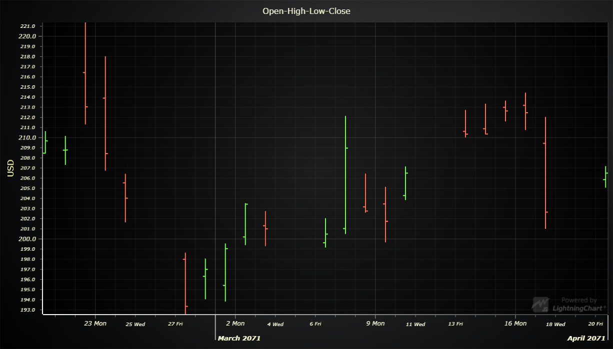

# OHLC Chart



This demo application belongs to the set of examples for LightningChart JS, data visualization library for JavaScript.

LightningChart JS is entirely GPU accelerated and performance optimized charting library for presenting massive amounts of data. It offers an easy way of creating sophisticated and interactive charts and adding them to your website or web application.

The demo can be used as an example or a seed project. Local execution requires the following steps:

- Make sure that relevant version of [Node.js](https://nodejs.org/en/download/) is installed
- Open the project folder in a terminal:

        npm install              # fetches dependencies
        npm start                # builds an application and starts the development server

- The application is available at *http://localhost:8080* in your browser, webpack-dev-server provides hot reload functionality.


## Description

*Also known as Price Chart, Bar Chart*

This example shows basic implementation of OHLC chart using OHLC-series.

```javascript
// OHLCSeries exists inside XY-charts.
const chart = lightningChart().ChartXY()
const ohlcSeries = chart.addOHLCSeries(
    // Specify type of figure used
    { positiveFigure: OHLCFigures.Bar }
)
```

OHLC-series accept data in the form of interface 'XOHLC':

```javascript
const xohlc = [
    // X-position
    0,
    // Opening Y-value
    100,
    // Highest Y-value
    200,
    // Lowest Y-value
    50,
    // Closing Y-value
    75
]
// Add new segment to series.
ohlcSeries.add(xohlc)
```

`add()` can be called with a single XOHLC-object or with an array of them.

### Anatomy of a Bar figure

A bar figure is formed from three line segments, which can be styled with a single *LineStyle* object.

[//]: # "IMPORTANT: The assets will not show before README.md is built - relative path is different!"


### Figure styling

OHLC Series provides an ability to specify styles for both positive and negative candlesticks individually. 

```javascript
// Width of both positive and negative candlesticks
const figureWidth = 5.0
// Green color filling
const fillStylePositive = new SolidFill().setColor( ColorRGBA( 0, 128, 0 ) )
// Lime color filling
const fillStyleHighlightPositive = new SolidFill().setColor( ColorRGBA (0, 255, 0) )
// Black color stroke
const bodyStrokeStyle = new SolidLine().setFillStyle( new SolidFill().setColor( ColorRGBA( 0, 0, 0 ) ) ).setThickness( 1.0 )
// Green color stroke
const strokeStylePositive = new SolidLine().setFillStyle( new SolidFill().setColor( ColorRGBA( 0, 128, 0 ) ) )
// Lime color stroke
const strokeStylePositiveHighlight = new SolidLine().setFillStyle( new SolidFill().setColor( ColorRGBA( 0, 240, 0 ) ) )

ohlcSeries
	// Setting width of figures
	.setFigureWidth ( figureWidth )
	// Styling positive candlestick
	.setPositiveStyle ( ( candlestick ) => candlestick
        // Candlestick body fill style
		.setBodyFillStyle( fillStylePositive )
		// Candlestick body fill style when highlighted
        .setBodyFillStyleHighlight( fillStyleHighlightPositive )
		// Candlestick body stroke style
        .setBodyStrokeStyle( bodyStrokeStyle )
        // Candlestick stroke style
		.setStrokeStyle( strokeStylePositive )
		// Candlestick stroke style when highlighted
        .setStrokeStyleHighlight( strokeStylePositiveHighlight )
    )
	// Styling negative candlestick
	.setNegativeStyle( ( candlestick ) => candlestick
        // etc ...
    )
```


## API Links

* XY cartesian chart: [ChartXY]
* Axis tick strategies: [AxisTickStrategies]
* Scroll strategies: [AxisScrollStrategies]
* Figure types: [OHLCFigures]
* OHLC series: [OHLCSeries]
* XOHLC datastructure: [XOHLC]
* OHLC generator: [OHLCGenerator]


## Support

If you notice an error in the example code, please open an issue on [GitHub][0] repository of the entire example.

Official [API documentation][1] can be found on [Arction][2] website.

If the docs and other materials do not solve your problem as well as implementation help is needed, ask on [StackOverflow][3] (tagged lightningchart).

If you think you found a bug in the LightningChart JavaScript library, please contact support@arction.com.

Direct developer email support can be purchased through a [Support Plan][4] or by contacting sales@arction.com.

[0]: https://github.com/Arction/
[1]: https://www.arction.com/lightningchart-js-api-documentation/
[2]: https://www.arction.com
[3]: https://stackoverflow.com/questions/tagged/lightningchart
[4]: https://www.arction.com/support-services/

© Arction Ltd 2009-2020. All rights reserved.


[ChartXY]: https://www.arction.com/lightningchart-js-api-documentation/v1.2.0/classes/chartxy.html
[AxisTickStrategies]: https://www.arction.com/lightningchart-js-api-documentation/v1.2.0/globals.html#axistickstrategies
[AxisScrollStrategies]: https://www.arction.com/lightningchart-js-api-documentation/v1.2.0/globals.html#axisscrollstrategies
[OHLCFigures]: https://www.arction.com/lightningchart-js-api-documentation/v1.2.0/globals.html#ohlcfigures
[OHLCSeries]: https://www.arction.com/lightningchart-js-api-documentation/v1.2.0/classes/chartxy.html#addohlcseries
[XOHLC]: https://www.arction.com/lightningchart-js-api-documentation/v1.2.0/globals.html#xohlc
[OHLCGenerator]: https://arction.github.io/xydata/classes/ohlcgenerator.html

